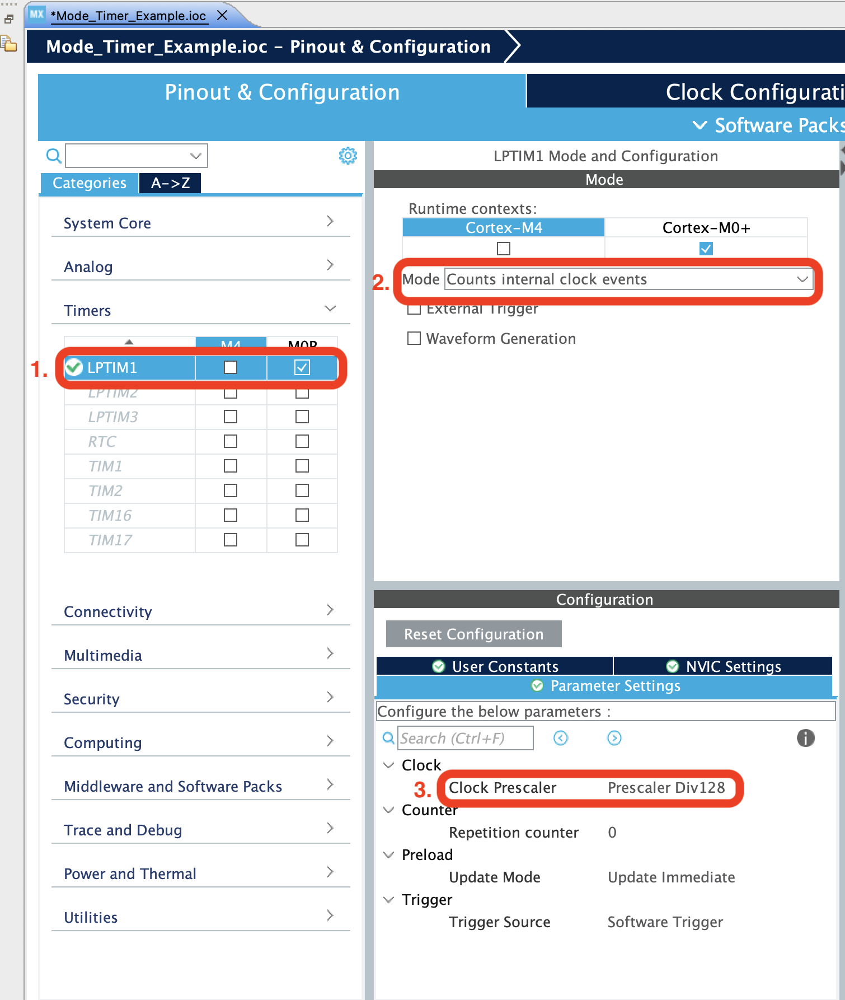
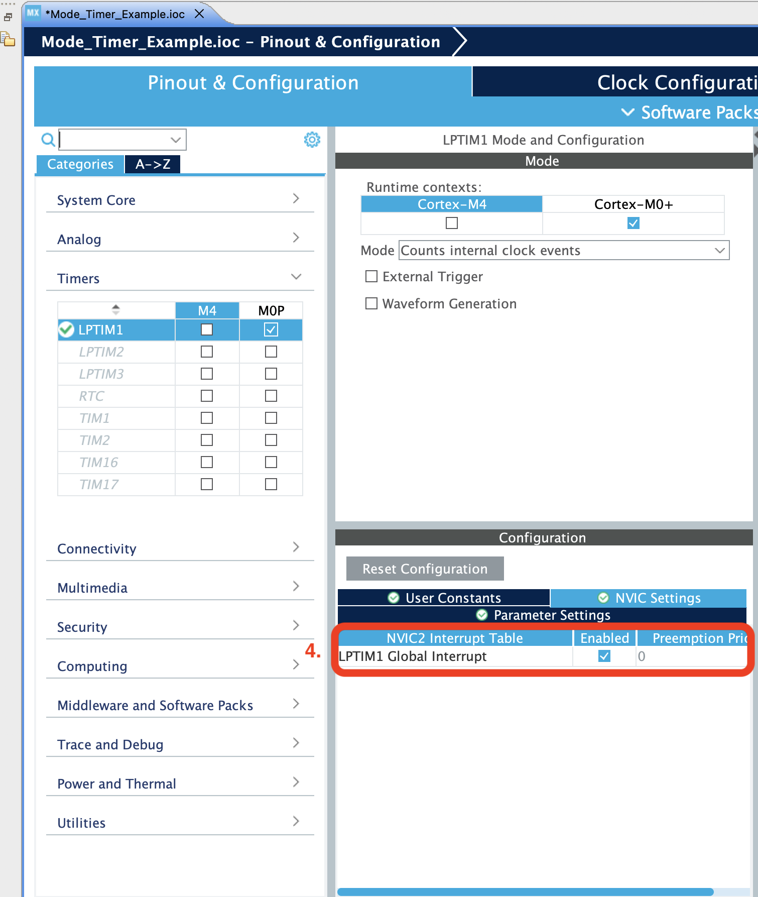
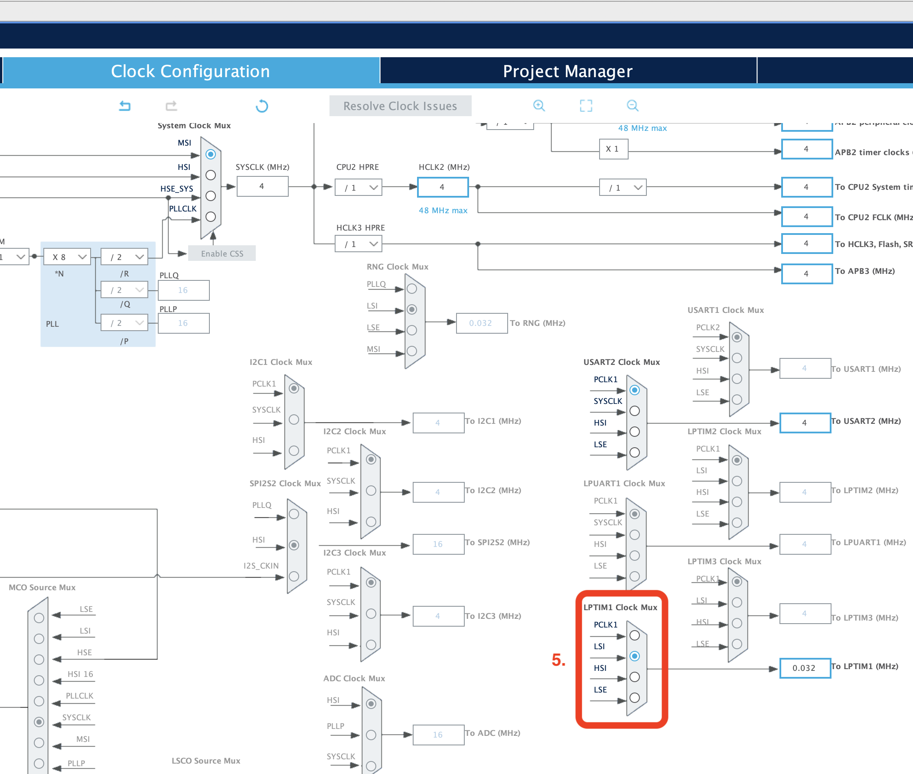
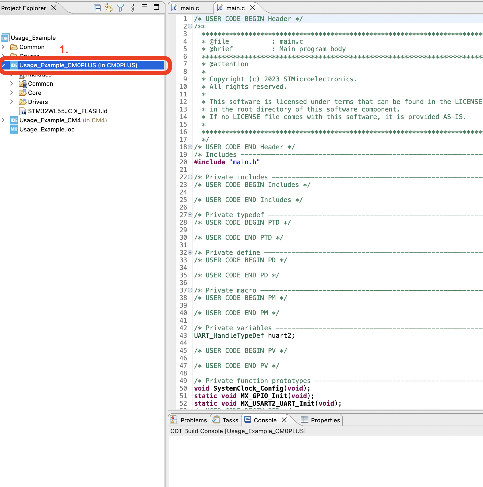
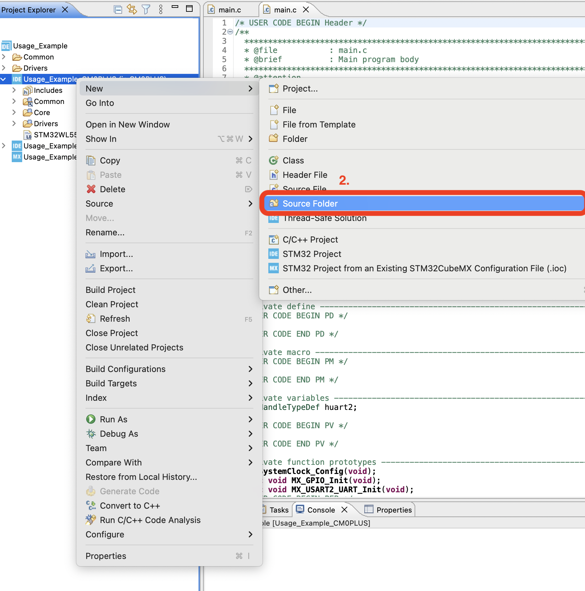
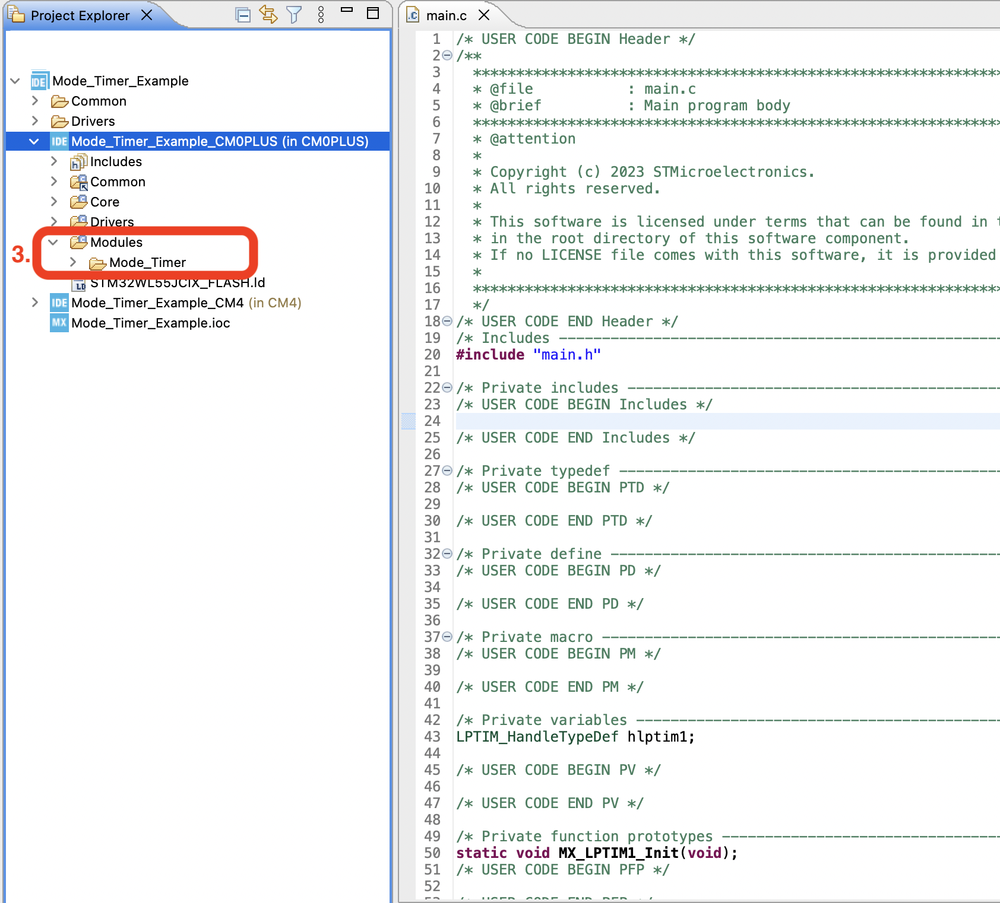
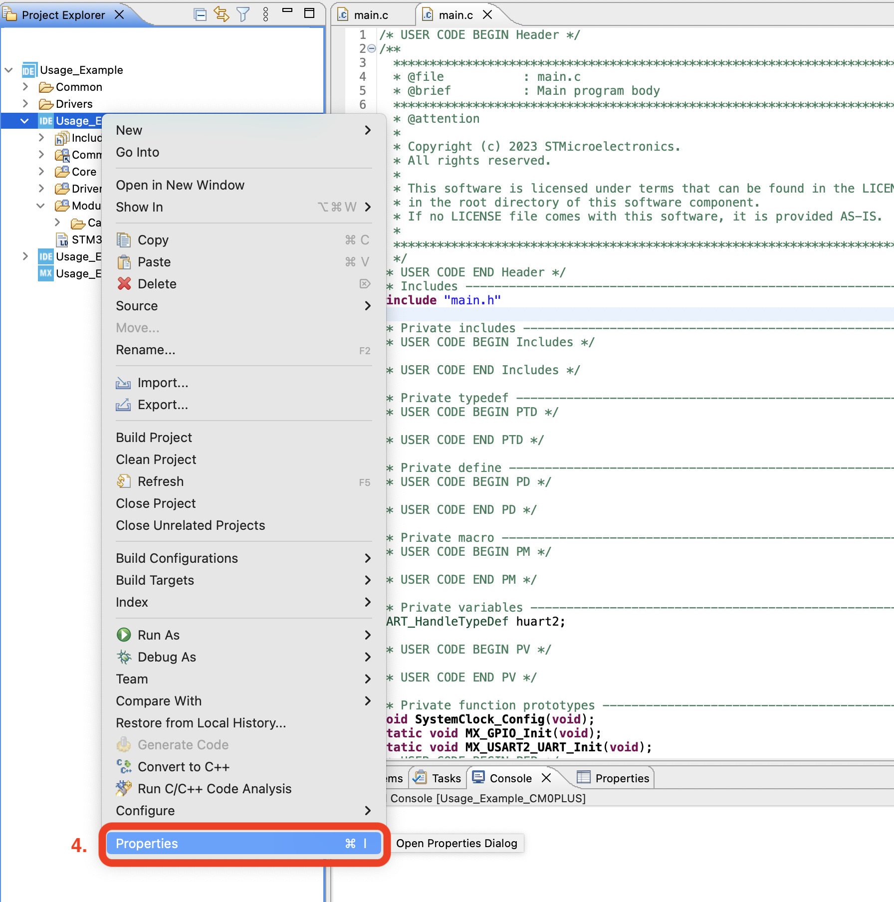
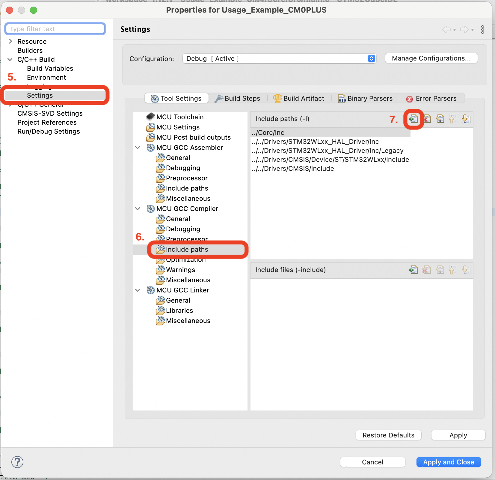
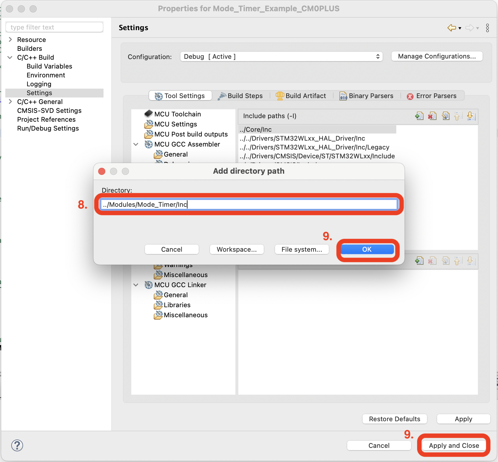
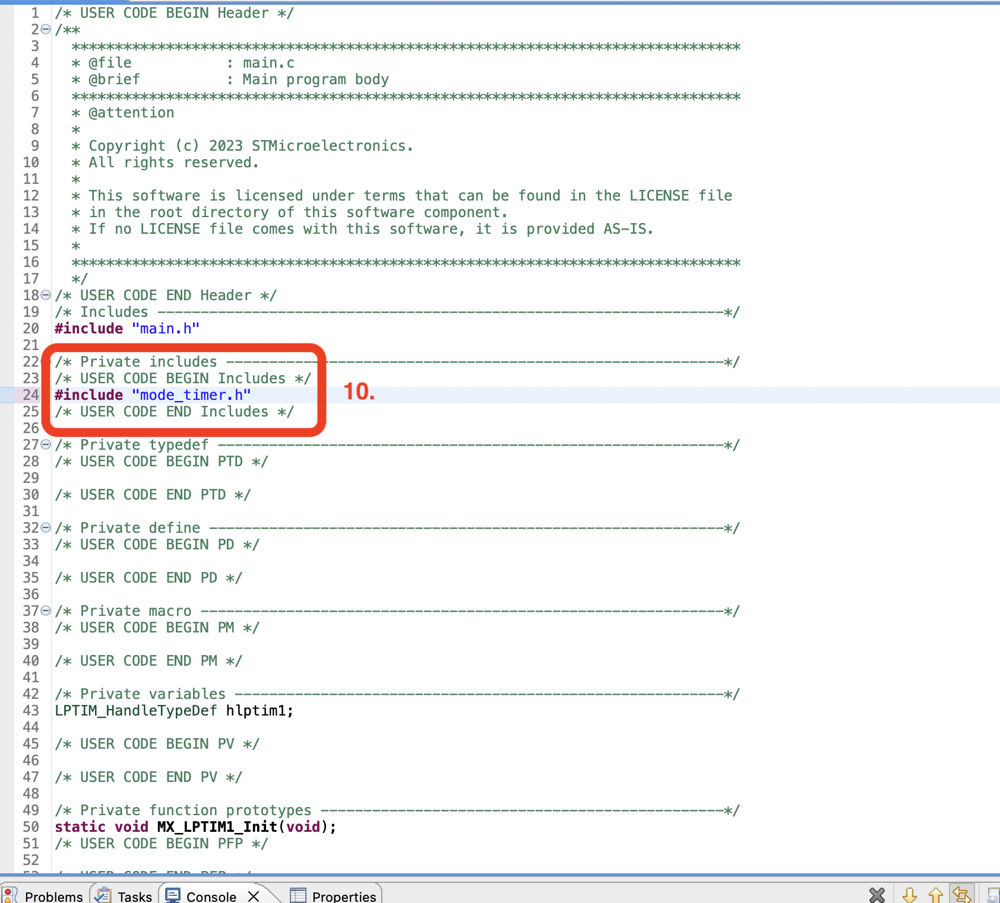

# STM32WL5x Mode Timer

The STM32WL5x Mode Timer

___

## Conceptual Design

___

## Installation/Usage

To use the Mode Timer module add the provided directory to your STM32CubeMX project and include mode_timer.h.

### STM32CubeMX Configuration

Before you can use the module a hardware timer must be enabled an configured.  **One possible configuration is as follows:**

1. Open the STM32CubeMX configuration tool within your project and enable one of the hardware timers.  I recommend LPTIM1.
2. Set the LPTIM1's mode to count internal clock events.
3. Set the clock prescalar to divide by 128.
4. Go into the NVIC settings and enable global interrupts.
5. Now under the Clock Configuration, select the clock source for LPTIM1 to be the LSI.

This configuration will update the timer at 250 Hz (32,000 Hz LSI and 128 prescalar division).

### Adding to Your STM32CubeMX Project

Now you are ready to add the module code.  Create a new source folder and add the module's header files to the compiler's include directory.

1. Right click on the sub-project for the core you want to use the module in.
2. Navigate to New > Source Folder.
3. Name the new Source Folder Modules.  Copy the Mode_Timer folder into here.
4. Right click again on the same sub-project.  Navigate to Properties.
5. On the left side, navigate to C/C++ Build > Settings.
6. Within that window navigate to MCU GCC Compiler > Include Paths.
7. Add a new Include Path.
8. Enter "../Modules/Mode_Timer/Inc".
9. Click Okay and exit the window.
10. Now include "mode_timer.h" in the file you want to use it within.

### Example Usage

A very simple usage example STM32CubeMX project is provided.  For a more interesting experience I have included an additional module called LED Debug.  All it does is provide some basic functionality to turn on and off the LEDs on the STM32WL55JC development board.  The example turns on the blue LED when the mode timer's pulse starts, and turns it off when the pulse ends.  This can be seen in the following callback functions.

    /*
     * Activate the blue LED at start of pulse.
     */
    void pulse_start(void)
    {
        activate_led(BLUE_LED);
    }

    /*
     * Deactivate the blue LED at end of pulse.
     */
    void pulse_end(void)
    {
        deactivate_led(BLUE_LED);
    }

It is also necessary to call the *modeTimer_CompareMatch_IRQ()* function within the *HAL_LPTIM_CompareMatchCallback()* function as such,

    /*
     * Mode timer period end.
     */
    void HAL_LPTIM_CompareMatchCallback(LPTIM_HandleTypeDef *hlptim)
    {
        if (hlptim->Instance == LPTIM1)
            modeTimer_CompareMatch_IRQ();
    }

and to call the *modeTimer_AutoReload_IRQ()* function within the *HAL_LPTIM_AutoReloadMatchCallback()* function as such.

    /*
     * Mode timer period start.
     */
    void HAL_LPTIM_AutoReloadMatchCallback(LPTIM_HandleTypeDef *hlptim)
    {
        if (hlptim->Instance == LPTIM1)
            modeTimer_AutoReload_IRQ();
    }

Within the *main()* function, initialize the mode timer module after the HAL has initialized the LPTIM1 and before the main loop.  Configure it to have a period of 1 second and a pulse of 0.5 seconds.  The timer is capable of having a period and pulse up to 262.14 seconds since the LPTIM1 is a 16 bit timer.

    // initialize the mode timer
    modeTimer_init(&hlptim1);

    // set the mode timer to have a period of 1 second
    // and a pulse length of 0.5 seconds
    // set to call event_start() when the pulse starts and
    // call event_end() when the pulse ends (turns blue led
    // on and off).
    modeTimer_configure(250, 250/2, &(pulse_start), &(pulse_end));

Finally, start the mode timer before the main loop.

    // start the mode timer
    modeTimer_start();

___

## Notable Design Choices and Limitations

The Mode Timer module is essentially a wrapper for running a timer in PWM mode using the HAL.

___

## API

### Return Codes

1. **MODE_TIMER_STATUS** - Status code returns from API function calls to signal if the call was successful or why the call was unsuccessful:
    - **MODE_TIMER_OKAY** - API function call was successfully completed.
    - **MODE_TIMER_NOT_INIT** - The Mode Timer module has not been initialized before API call.

### Functions

1. **bool modeTimer_init(LPTIM_HandleTypeDef* const hlptim)** - Initialize the mode timer module.  Must be called before the module can operate.
    - Parameters:
        - **hlptim** - pointer to LPTIM_HandleTypeDef (HAL handle) for a low-powered timer.
    - Return:
        - **bool** - false if the pointer passed was NULL, true otherwise.

2. **MODE_TIMER_STATUS modeTimer_configure(const uint16_t period, const uint16_t pulse, void (\*startCallback)(), void (\*endCallback)())** - Configure the PRI settings (period and pulse width) and set callback functions to fun at the start and end of each pulse.
    - Parameters:
        - **period** - 16-bit auto-reload value (period of the PRI)
        - **pulse** - 16 bit compare-match value (pulse width of the PRI)
        - **startCallback** - pointer to function to execute at start of pulse
        - **endCallback** - pointer to function to execute at end of pulse
    - Return:
        - **MODE_TIMER_NOT_INIT** - if the module has not been initialized
        - **MODE_TIMER_OKAY** - successful

3. **MODE_TIMER_STATUS modeTimer_start(void)** - Start the mode timer.
    - Return:
        - **MODE_TIMER_NOT_INIT** - if the module has not been initialized
        - **MODE_TIMER_OKAY** - successful

4. **MODE_TIMER_STATUS modeTimer_stop(void)** - Stops the mode timer.
    - Return:
        - **MODE_TIMER_NOT_INIT** - if the module has not been initialized
        - **MODE_TIMER_OKAY** - successful

5. **void modeTimer_CompareMatch_IRQ(void)** - ISR for mode timer.
    - Note:
        - Call within HAL_LPTIM_CompareMatchCallback() surrounded by if (hlptim->Instance == LPTIMx), where LPTIMx is LPTIM1, LPTIM2, or LPTIM3 whichever you use in modeTimer_init().

6. **void modeTimer_AutoReload_IRQ(void)** - ISR for mode timer.
    - Note:
        - Call within HAL_LPTIM_AutoReloadMatchCallback() surrounded by if (hlptim->Instance == LPTIMx), where LPTIMx is LPTIM1, LPTIM2, or LPTIM3 whichever you use in modeTimer_init().